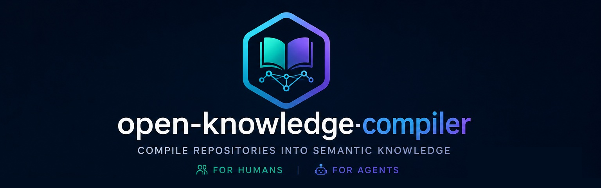

# Open Knowledge Compiler

[](https://github.com/kushal-omnius/open-knowledge-compiler/actions/workflows/ci.yml)
[](LICENSE)
[](pyproject.toml)
[](https://bundledex.net)

Compiles software engineering artifacts (Git repos, PRs, Jira, docs, OpenAPI, tests) into a structured, persistent knowledge base — queryable by humans (living wiki) and AI agents (MCP). Not another RAG system: raw artifacts go in once, compiled knowledge stays synchronized through incremental, PR-triggered compilation.

**Status:** Architecture v1.0 frozen · V1 pipeline implemented (deterministic compiler for Python + TypeScript + JavaScript, incremental compilation with reconcile + verify, OKF v0.2-conformant wiki with loop-safe branch publishing and its own `kc validate-okf` checker, opt-in LLM semantic layer, opt-in embeddings with hybrid retrieval, read-only MCP server). Apache-2.0, dogfooded on real repositories including compiling itself (`kc verify`-clean, `kc validate-okf`-conformant). CI runs the full test suite on every push/PR against a real Postgres instance. Next: incremental `--pr` compilation wired into CI for this repo itself, and a real entry-point plugin ecosystem beyond the built-ins.

- Design: [docs/vision.md](docs/vision.md) · [docs/architecture.md](docs/architecture.md) · [docs/decisions/index.md](docs/decisions/index.md)
- Contracts: [docs/ir.md](docs/ir.md) · [docs/data-model.md](docs/data-model.md) · [docs/pipeline.md](docs/pipeline.md) · [docs/normalize.md](docs/normalize.md) · [docs/retrieval.md](docs/retrieval.md)
- Releases: [CHANGELOG.md](CHANGELOG.md) · multi-repo setup: [docs/cross-repo-workflows.md](docs/cross-repo-workflows.md)
- **Example:** this repo compiling itself — [live wiki](../../tree/knowledge/wiki) (63 components, plus real business rules/features/risks from the LLM semantic layer)

## North star

Every design decision here should serve one question:

> Given what this software does and what changed, what exactly must be verified — and how do we know the resulting test is actually trustworthy?

Structural knowledge (components, APIs, dependencies) is necessary but not the differentiator — generic code-intelligence tools already do that well. What doesn't exist elsewhere is the answer to the two halves of that question: a **Behavioral Contract** model (state, transitions, and failure modes — not just structure) for *what must be verified*, and a **Test Trust Score** (mutation-kill rate, flakiness, escaped-defect history, and coverage completeness combined into one signal) for *is the resulting test trustworthy*. That pairing is the moat.

## Table of contents

- [North star](#north-star)
- [Why OKF](#why-okf)
- [Prerequisites](#prerequisites)
- [Installation](#installation)
- [Analyze a repository](#analyze-a-repository)
- [Run modes](#run-modes)
- [Configuration](#configuration)
- [Semantic layer (LLM extraction)](#semantic-layer-llm-extraction-optional)
- [MCP server (local)](#mcp-server-local)
- [Retrieval and semantic search](#retrieval-and-semantic-search-optional)
- [Cross-repo workflows](#cross-repo-workflows)
- [Development](#development)
- [Contributing](#contributing)
- [License](#license)

## Why OKF

The wiki this project compiles isn't a bespoke format — it's an [OKF](https://github.com/GoogleCloudPlatform/knowledge-catalog/blob/main/okf/SPEC.md) (Open Knowledge Format) bundle: plain Markdown with YAML frontmatter, readable by any editor and by any OKF-aware agent, with no proprietary SDK or vendor lock-in. OKF is deliberately minimal — the only universal requirement is a `type` field — and it explicitly separates *producers* (things that write knowledge) from *consumers* (things that read it), so tooling on either side can be swapped independently.

Hand-maintained OKF bundles (an Obsidian vault, a `docs/` folder someone remembers to update) drift the moment nobody's looking. Open Knowledge Compiler is a **producer**: it compiles a conformant, always-current OKF bundle directly from your Git history, PRs, and code — no one has to remember to update it, because it's regenerated on every merge. See [docs/okf-conformance.md](docs/okf-conformance.md) for exactly how the emitted bundle maps to the spec, and `kc validate-okf` to check any bundle against it.

## Prerequisites

- **Python 3.11+** — `python --version` to check
- **Docker Desktop** — for the Postgres database ([download](https://www.docker.com/products/docker-desktop/))
- **Git** — the repo you want to analyze must be a local git clone

NOTE - No API keys required for the base compile. LLM and embedding providers are opt-in (see below).

## Installation

```bash
git clone https://github.com/kushal-omnius/open-knowledge-compiler.git
cd open-knowledge-compiler

# Create and activate a virtual environment
python -m venv venv
venv\Scripts\activate          # Windows
# source venv/bin/activate     # macOS / Linux

pip install -e .[all]

# Start Postgres (runs in Docker, port 5432, db=kc_wiki user=kc pass=kc)
docker compose up -d
```

Verify the install:

```bash
kc --help
```
See full CLI Documentation: [kc-cli-reference.md](docs/kc-cli-reference.md)

## Analyze a repository

Point `--dir` at any local git clone.

**Step 1 — Register the repo** (run once):

```bash
kc init \
  --slug my-service \
  --forge-ref github.com/my-org/my-service \
  --dir /path/to/my-service
```

This writes a `kc.toml` into `/path/to/my-service` and registers the repo in Postgres.

**Step 2 — Load credentials** (if using LLM / embeddings):

KC reads env vars directly — it does not auto-load `.env` files. Load them before compiling:

```bash
# PowerShell
Get-Content .env | ForEach-Object { if ($_ -match '^([^#][^=]*)=(.*)$') { [System.Environment]::SetEnvironmentVariable($matches[1].Trim(), $matches[2].Trim(), 'Process') } }

# macOS / Linux
set -a && source .env && set +a
```

Or use `python-dotenv` (no shell quoting issues):

```bash
pip install python-dotenv
python -m dotenv run -- kc compile --full --dir /path/to/my-service
```

Skip this step entirely if running `--no-llm` (no credentials needed for the deterministic pass).

**Step 3 — Compile** (run from anywhere, `--dir` points at the repo):

```bash
kc compile --full --dir /path/to/my-service        # with LLM (requires credentials)
kc compile --full --no-llm --dir /path/to/my-service  # deterministic only, no credentials
```

This runs the full pipeline: Git history → code analysis → entity extraction → wiki generation. First run takes a minute or two depending on repo size. During the run, `[llm] i/n <file> --changed` lines stream to stderr for each file that required a real LLM call (cache hits are silent); `[embed] n/total <N> entities --changed` lines stream once per batch of 64 dirty entities. Add `-v` to see a per-slug entity breakdown in the final summary.

A run with `--no-llm` is marked `degraded` — it produces all structural entities (Component, API, TestCoverage, PullRequest) but skips Feature, BusinessRule, and Risk extraction. Previously extracted semantic entities are never removed by a degraded run.

**Step 4 — Inspect results:**

```bash
kc inspect --dir /path/to/my-service
```

```
repository: my-service
entities: 312
  component: 78  api: 24  feature: 61  business_rule: 12  risk: 18  test_coverage: 119
relationships: 940
last compile: run 1 @ a3f9c1d20b12 [2026-07-18 09:14:22] — delta add:312  change:0  remove:0
```

A browsable Markdown wiki is written to `kc-wiki/` inside the analyzed repo. This is a real, unedited page from this project's own `kc-wiki/component/` — Open Knowledge Compiler compiling itself:

```yaml
---
type: component
title: "knowledge_compiler.wiki.emitter"
slug: component/knowledge-compiler-wiki-emitter
repo: knowledge-compiler
compile_run: 1365
commit: f4f91e0a7428b263baa6af08d3388226bf68ed83
files:
  - knowledge_compiler/wiki/emitter.py
generated:
  by: process:knowledge-compiler/0.1.0
  at: 2026-08-05T19:31:59.019805+00:00
---
```
```markdown
# knowledge_compiler.wiki.emitter

**Kind:** module · **Language:** python

**Files:** `knowledge_compiler/wiki/emitter.py`

## Symbols

| Symbol | Kind |
|---|---|
| `knowledge_compiler.wiki.emitter.WikiEmitter` | class |
| `knowledge_compiler.wiki.emitter.WikiEmitter.emit` | method |
| `knowledge_compiler.wiki.emitter.WikiEmitter._render_index` | method |
...

## Depends on
- `knowledge_compiler.ir`
```

That YAML frontmatter is the OKF-conformant part — every field either required (`type`), recommended (`title`), or an explicit KC extension (`slug`, `repo`, `compile_run`, `commit`, `files`), plus a spec-shaped `generated: {by, at}` provenance block. `kc validate-okf` checks exactly this structure holds across the whole bundle.

**Step 5 — Verify (optional):**

```bash
kc verify --dir /path/to/my-service
# VERIFIED: incremental state is equivalent to a full compile
```

No API keys required — the deterministic compiler produces components, APIs, dependencies, test coverage, and the wiki on its own.

## Run modes

| Command | What it does |
|---|---|
| `kc init --slug <slug> --forge-ref <ref>` | Register a repo: run migrations, insert repo row, write `kc.toml`. Run once before first compile. |
| `kc compile --full` | Full recompile against HEAD — re-extracts every file. Use for first compile, after a large restructure, or when `kc verify` reports drift. |
| `kc compile --full -v` | Same, plus a per-slug breakdown of added/changed/removed entities in the summary |
| `kc compile --pr N` | Incremental: compile one specific merged PR, idempotent |
| `kc compile --no-llm` | Deterministic pass only; uses tree-sitter, run marked degraded; semantic entities are never removed |
| `kc compile --emit-only` | Re-render the wiki from already-compiled Knowledge IR only — no Collect/Extract/Normalize, no new compile run. The cheap OKF-spec-version rollout path ([ADR-013](docs/decisions/ADR-013-open-source-okf-conformance.md)) |
| `kc reconcile` | Catch up on merged PRs and direct commits since the last compile — only changed files are extracted, so it is much cheaper than `--full` when run frequently (1–3 PRs at a time). Preserves per-PR entity attribution. Needs `KC_GITHUB_TOKEN` or `GITHUB_TOKEN`. |
| `kc reconcile -v` | Same, plus a per-slug breakdown of added/changed/removed entities in the summary |
| `kc verify` | Zero-write shadow compile; reports drift between incremental state and a full compile |
| `kc inspect` | The debugging surface: counts by type + last delta |
| `kc validate-test <file> --for-entity <slug>` | Score a generated test's `kc-covers:` header against compiled knowledge; exits 1 if header missing or any slug doesn't exist ([ADR-012](docs/decisions/ADR-012-defer-verification-requirement-entity.md)) |
| `kc validate-okf` | Check the emitted wiki bundle against OKF conformance rules ([ADR-013](docs/decisions/ADR-013-open-source-okf-conformance.md), [docs/okf-conformance.md](docs/okf-conformance.md)) |
| `kc serve` | Read-only MCP server (stdio) over the knowledge base — never compiles (`pip install -e .[serve]`) |

## Configuration

All external configuration lives in env vars and `kc.toml` (written by `kc init`) — nothing is hardcoded:

- `KC_DATABASE_URL` — Postgres URL (default matches `docker-compose.yml`)
- `KC_GITHUB_TOKEN` / `GITHUB_TOKEN` — forge API for `--pr`/`reconcile`; `KC_GITHUB_API` for GHE
- `kc.toml [wiki]` — local publication directory
- `kc.toml [publisher]` — opt-in loop-safe publishing to a `knowledge/wiki` branch (ADR-010)
- `kc.toml [llm]` — opt-in semantic layer (ADR-008): business rules, features, risks
- `kc.toml [embeddings]` — opt-in semantic search vectors (ADR-005); without them `kc serve` search is keyword-only (fully functional)

## Semantic layer (LLM extraction) (optional)

  - Extracts meaning from code → Feature, BusinessRule, Risk entities
  - Runs at compile time
  - Opt-in via `[llm] enabled = true`

```toml
[llm]
enabled = true
provider = "openai"        # "anthropic" (default) | "openai" | "azure-openai"
# model = "gpt-4o"         # per-provider default applies when omitted
max_calls_per_run = 200    # budget cap: exceeding fails the run resumably (cache keeps paid work)
```

```bash
pip install -e .[llm-openai]      # or .[llm] for Anthropic
# credentials come from the environment, never from config files:
#   OPENAI_API_KEY (openai) / ANTHROPIC_API_KEY (anthropic)
#   OPENAI_AZURE_ENDPOINT / OPENAI_AZURE_API_KEY / OPENAI_AZURE_DEPLOYMENT (azure-openai)
#   OPENAI_AZURE_DEPLOYMENT names a chat/completion deployment (e.g. gpt-4o-mini) —
#   a *separate* deployment from embeddings (see below); see llm-usage.md for why
#   Azure OpenAI needs two distinct deployments even on one resource/endpoint.
kc compile --full --dir /path/to/my-service
```

LLM outputs are schema-validated before persistence, cached content-addressed in Postgres (unchanged files cost zero on recompile), and every semantic fact carries provenance (model, template version, anchors into source). Provider outage degrades the compile gracefully — the deterministic knowledge base is never blocked on an API. Test files are excluded from semantic extraction by default (`[llm] include_tests = true` to override).

## MCP server (local)

`kc serve` is a read-only MCP server (stdio transport) over the compiled knowledge base. It **never compiles** — it reads whatever the last `kc compile` produced. Any MCP-compatible AI agent (Claude Code, Claude Desktop, Cursor, VS Code extensions, etc.) can connect to it.

**Prerequisites:** at least one `kc compile --full` run must have succeeded first.

```bash
pip install -e .[serve]    # adds the MCP SDK dependency
kc serve --dir /path/to/repo
```

### Register with Claude Code (CLI)

```bash
claude mcp add kc -- kc serve --dir /path/to/repo
```

To serve multiple repos, add one entry per repo:

```bash
claude mcp add kc-frontend -- kc serve --dir /path/to/frontend
claude mcp add kc-backend  -- kc serve --dir /path/to/backend
```

### Register with Claude Desktop / other MCP clients

Add to your MCP client's config file (e.g. `claude_desktop_config.json`, `.claude/mcp.json`, or the equivalent for your client):

```json
{
  "mcpServers": {
    "kc": {
      "command": "kc",
      "args": ["serve", "--dir", "/path/to/repo"]
    }
  }
}
```

If `kc` is not on the system PATH (e.g. inside a venv), use the full path to the executable:

```json
{
  "mcpServers": {
    "kc": {
      "command": "/path/to/repo/venv/bin/kc",
      "args": ["serve", "--dir", "/path/to/repo"]
    }
  }
}
```

On Windows, replace `/bin/kc` with `\\Scripts\\kc.exe`.

### MCP tools exposed

`search_knowledge`, `get_entity`, `impact_plan`, `test_plan`, `resolve_dependency` ([ADR-011](docs/decisions/ADR-011-cross-repo-dependency-resolution.md)), `list_entities`, `recent_changes`, `which_pr_introduced`, `coverage_for`, `knowledge_stats`, `linked_context`, `journey_coverage` ([ADR-017](docs/decisions/ADR-017-user-journey-entity.md)) — see [docs/kc-cli-reference.md](docs/kc-cli-reference.md) for full parameter and return-value documentation.

## Retrieval and semantic search (optional)

 - Without embeddings, `kc serve` search runs keyword-only (Postgres FTS) — fully functional.
 - Enable embeddings to add semantic matching fused with keyword results via reciprocal-rank fusion.
 - Opt-in via `[embeddings] enabled = true`

```toml
[embeddings]
enabled = true
provider = "openai"        # "openai" | "azure-openai"
# model = "text-embedding-3-small"
```

```bash
# azure-openai credentials: OPENAI_AZURE_ENDPOINT / OPENAI_AZURE_API_KEY (shared with [llm]) +
#   OPENAI_AZURE_EMBEDDING_DEPLOYMENT — a dedicated embedding-model deployment
#   (e.g. text-embedding-3-small), distinct from [llm]'s OPENAI_AZURE_DEPLOYMENT
#   chat deployment. See llm-usage.md for the full two-deployment rationale.
kc compile --full    # embeds dirty entities as a post-persist stage; re-run after enabling
```

See [docs/retrieval.md](docs/retrieval.md) for the retrieval design.

## Cross-repo workflows

When Repo A depends on Repo B, and a QA agent writes tests in Repo C, compile all repos into the same KC database and declare the dependency in `kc.toml`:

```bash
# Compile both repos into the same KC_DATABASE_URL
kc init --slug repo-b --forge-ref github.com/org/repo-b --dir /path/to/repoB
kc compile --full --dir /path/to/repoB

kc init --slug repo-a --forge-ref github.com/org/repo-a --dir /path/to/repoA
kc compile --full --dir /path/to/repoA
```

In Repo A's `kc.toml`:

```toml
[dependencies]
# import prefix → compiled slug in the same database (ADR-011, query-time only)
repo_b = "repo-b"
```

The QA agent connects to `kc serve --dir /path/to/repoA`. It can then:
- Call `test_plan("component/something")` — cross-repo reachability included
- Call `resolve_dependency("repo_b.SomeClass")` — gets Repo B's full entity detail
- Run `kc validate-test /path/to/repoC/tests/test_x.py --for-entity component/something --dir /path/to/repoA` — test file and knowledge base are decoupled

See [docs/cross-repo-workflows.md](docs/cross-repo-workflows.md) for the full setup guide and current limitations.

## Development

```bash
pytest                             # full suite (integration tests skip without Postgres)
pytest tests/test_normalize.py     # only the identity-cascade suite
```

## Contributing

Contributions are welcome — see [CONTRIBUTING.md](CONTRIBUTING.md) for dev setup, testing conventions, and PR expectations. This project follows a [Code of Conduct](CODE_OF_CONDUCT.md). Found a security issue? See [SECURITY.md](SECURITY.md) for how to report it responsibly.

## License

Apache-2.0 — see [LICENSE](LICENSE).
