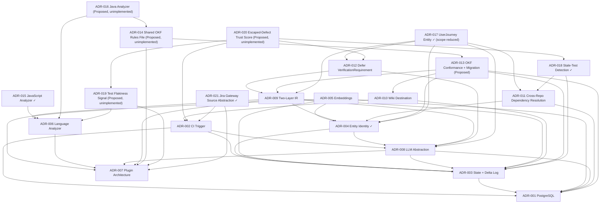

# ADR Index

Table of contents for the Knowledge Compiler's architectural decisions. For the ADR process (lifecycle, template, how to propose), see [README.md](README.md).

## Decisions

### [ADR-001 — PostgreSQL](ADR-001-postgresql.md)

- **Status:** Accepted
- **Summary:** A single PostgreSQL database is the only persistent store, covering relations, JSONB payloads, full-text search, vectors, transactions, and advisory locks in one system.
- **Dependencies:** none (foundation)
- **Depended on by:** ADR-002 (advisory locks, read-only serve), ADR-003 (transactional persist), ADR-005 (pgvector), ADR-008 (cache in Postgres), ADR-013 (durable-store invariant the OKF migration story relies on)
- **Related documents:** architecture.md §5, data-model.md, storage.md (planned)

### [ADR-002 — CI Trigger](ADR-002-ci-trigger.md)

- **Status:** Accepted
- **Summary:** Compilation is triggered by CI invoking `kc compile --pr N` on merge, made exactly-once and self-healing by mandatory reconcile-first processing and per-repo advisory locks; the serve process never compiles.
- **Dependencies:** ADR-001 (locks), ADR-003 (`compile_runs` watermark, delta ordering), ADR-008 (cache bounds backlog cost); related: ADR-004 (in-order processing preserves matching state)
- **Depended on by:** —
- **Related documents:** architecture.md §3, pipeline.md, mcp.md (planned)

### [ADR-003 — Current State + Delta Log](ADR-003-current-state-delta-log.md)

- **Status:** Accepted
- **Summary:** Compiled knowledge is stored as mutable current-state tables plus an append-only delta log, written in one transaction per compile; history is deltas, and the past is recompilable, not stored.
- **Dependencies:** ADR-001 (transactions)
- **Depended on by:** ADR-002 (watermarking), ADR-004 (identity matches against current state), ADR-005 (delta-driven re-embedding), ADR-008 (incremental economics), ADR-013 (delta log as the mechanism `log.md`'s date-grouped history derives from)
- **Related documents:** architecture.md §4–5, ir.md, data-model.md, pipeline.md

### [ADR-004 — Stable Entity Identity](ADR-004-entity-identity.md)

- **Status:** Accepted
- **Summary:** Deterministic entities use natural keys; LLM-derived entities use a deterministic match-then-mint cascade (external key → anchor overlap → name similarity); the LLM never assigns identity; over-split beats over-merge; reproducibility holds modulo slug renaming.
- **Dependencies:** ADR-003 (current state as matching target), ADR-008 (cache prevents extraction flapping)
- **Depended on by:** ADR-002 (in-order processing), ADR-005 (embeddings excluded from identity), ADR-006 (anchors as extractor obligation), ADR-008 (identity invariant enforced at the LLM layer), ADR-013 (slug stability assumed by re-render-not-recompile); vision.md Design Principle 8 originates here
- **Related documents:** architecture.md §6, ir.md, data-model.md, pipeline.md

### [ADR-005 — Embeddings](ADR-005-embeddings-pgvector.md)

- **Status:** Accepted
- **Summary:** Embeddings live in pgvector as derived, disposable, model-tagged artifacts computed from compiled entities (never raw source), re-embedded delta-first, and excluded from identity and deltas.
- **Dependencies:** ADR-001 (single store), ADR-003 (delta-driven), ADR-004 (identity exclusion), ADR-007 (embedding/retrieval providers as plugins)
- **Depended on by:** —
- **Related documents:** architecture.md §7, data-model.md, retrieval.md

### [ADR-006 — Language Analyzer](ADR-006-language-analyzers.md)

- **Status:** Accepted
- **Summary:** tree-sitter is the mandatory language-analyzer backbone (in-process Python, no Node.js) with optional per-language enrichment plugins; the deterministic pass must alone produce a correct structural knowledge base.
- **Dependencies:** ADR-007 (analyzers are plugins); related: ADR-004 (anchors feed the identity cascade)
- **Depended on by:** —
- **Related documents:** architecture.md §8, §12, ir.md, pipeline.md, plugin-system.md (planned)

### [ADR-007 — Plugin Architecture](ADR-007-plugin-architecture.md)

- **Status:** Accepted
- **Summary:** Plugins are discovered via packaging entry points and activated only by explicit `kc.toml` configuration; installing a package never changes compilation output; built-ins have no privileged path; interfaces are versioned and fail loudly.
- **Dependencies:** none (foundation)
- **Depended on by:** ADR-005 (providers), ADR-006 (analyzers), ADR-008 (LLM providers)
- **Related documents:** architecture.md §9, plugin-system.md (planned), pipeline.md

### [ADR-008 — LLM Abstraction](ADR-008-llm-abstraction-caching.md)

- **Status:** Accepted
- **Summary:** LLM access goes through one thin schema-validated provider interface (providers as plugins) with a load-bearing content-addressed cache in Postgres keyed by (prompt template version, model, input content) — making full recompilation affordable and extraction output stable.
- **Dependencies:** ADR-001 (cache storage), ADR-003 (incremental economics), ADR-007 (providers as plugins)
- **Depended on by:** ADR-002 (backlog catch-up cost), ADR-004 (flapping prevention assumption)
- **Related documents:** architecture.md §10, §12, data-model.md, pipeline.md, plugin-system.md (planned)

### [ADR-009 — Two-Layer IR](ADR-009-two-layer-ir.md)

- **Status:** Accepted
- **Summary:** The canonical IR has two versioned layers with a directional boundary — Fact IR (per-compile extraction output, identity-free, the plugin contract) and Knowledge IR (durable entities + relationships, the consumer contract) — with Normalize as the only crossing point; the delta is a derived Knowledge IR artifact.
- **Dependencies:** ADR-003 (delta as derived artifact), ADR-004 (entity definition, identity boundary), ADR-006 (analyzers emit canonical facts), ADR-007 (fail-loud policy), ADR-008 (validated LLM candidates)
- **Depended on by:** ADR-013 (the Fact IR / Knowledge IR boundary enabling Emit-stage-only reruns); implemented by `ir.md`
- **Related documents:** ir.md (implements it), data-model.md, pipeline.md, plugin-system.md (planned)

### [ADR-010 — Wiki Destination](ADR-010-wiki-destination.md)

- **Status:** Accepted
- **Summary:** The wiki publishes to a dedicated `knowledge/wiki` branch in the compiled repository (forge-rendered Markdown, publisher-owned, loop-safe by construction since branch pushes are not the ADR-002 trigger event). The Publisher concept is general (publication → destination; see pipeline.md §3.6): Pages, separate knowledge repo, Confluence, and OKF bundle export are additive publishers. **The canonical home of compiled knowledge is the database (ADR-001); this ADR places only the human-readable render.**
- **Dependencies:** ADR-002 (trigger scoping the loop-safety argument), ADR-003 (delta log as history of record)
- **Depended on by:** ADR-013 (wiki as disposable, wholesale-regenerated build artifact — the property the OKF migration story depends on); unblocks the publisher plugin contract, pipeline.md §8
- **Related documents:** architecture.md §11, pipeline.md §3.6/§8

### [ADR-011 — Cross-Repo Dependency Resolution](ADR-011-cross-repo-dependency-resolution.md)

- **Status:** Accepted
- **Summary:** Cross-repo dependency resolution (e.g. `X` importing `Y`) is query-time only for V1 — a `kc.toml` `[dependencies]` config map resolved in `kc serve`, matched exact-or-dotted-prefix. No Normalize/Persist/schema changes, no cross-`repo_id` reads during compile. The richer compiled `Project`-to-`Project` rollup edge (or full fine-grained cross-repo entity resolution) is explicitly deferred, not rejected, pending the milestone-3 evaluation-methodology question.
- **Dependencies:** ADR-001 (`repo_id` isolation invariant), ADR-004 (over-split-over-merge bias, extended to cross-repo linking)
- **Depended on by:** —
- **Related documents:** `BRAINSTORM-cross-repo-dependencies.md`, retrieval.md §5

### [ADR-012 — Defer VerificationRequirement Entity](ADR-012-defer-verification-requirement-entity.md)

- **Status:** Accepted
- **Summary:** `VerificationRequirement` (a candidate entity for LLM-extracted, sub-component verification obligations, e.g. "discount must not exceed 20%") is not added as a compiled entity in V1. Mutation-kill rate is the execution-based signal for sub-component test precision — it closes the motivating gap (declared-coverage can be 100% while missing the exact condition tested) at execution time, without new IR complexity or a richer agent workflow. Deferred, not rejected: reopens if agent-generated tests show a consistent pattern of high declared-coverage + low mutation-kill at scale, or if the component-vs-sub-component granularity mismatch noted in the ADR's rationale is shown to hide real misses.
- **Dependencies:** ADR-009 (two-layer IR — the entity model this would extend), ADR-008 (LLM semantic layer — the extraction mechanism this would use)
- **Depended on by:** —
- **Related documents:** `BRAINSTORM-verification-requirement.md`, `BRAINSTORM-test-generation-eval.md`, `BRAINSTORM-test-generation-mechanism.md` (full spike record)

### [ADR-013 — Open-Source Release + OKF Spec-Version Conformance and Migration](ADR-013-open-source-okf-conformance.md)

- **Status:** Proposed
- **Summary:** Open-sourcing Knowledge Compiler as `open-knowledge-compiler` positions it as a reference OKF producer; since the OKF spec is external and independently versioned (discovered mid-review: the authoritative spec had already moved to v0.2, exposing real conformance bugs against KC's v0.1-era emitter), track `OKF_SPEC_VERSION` explicitly (extending ir.md §5's `fact_vocabulary_version`/`knowledge_model_version` pattern) and handle all future spec migrations as Emit-stage-only re-renders against durable Knowledge IR — never a data migration. Database-less compilation, raised in the same discussion, is explicitly parked out of scope (`BRAINSTORM-db-less-compile-mode.md`).
- **Dependencies:** ADR-001 (durable store invariant), ADR-003 (delta log — `log.md`'s date-grouped history), ADR-004 (slug stability assumed by re-render-not-recompile), ADR-009 (Fact IR/Knowledge IR boundary enabling Emit-only reruns), ADR-010 (wiki as disposable, wholesale-regenerated build artifact — the property this ADR's migration story depends on)
- **Depended on by:** —
- **Related documents:** `docs/okf-conformance.md` (new, tracked separately), `data-model.md` (`compile_runs.okf_spec_version`), `ir.md` §5, `BRAINSTORM-db-less-compile-mode.md`

### [ADR-014 — Shared Declarative OKF Rules File (Emitter + Validator)](ADR-014-shared-okf-rules-file.md)

- **Status:** Proposed — **not implemented**
- **Summary:** `wiki/emitter.py` (what shape output takes) and `wiki/okf_conformance.py` (what shape is required) currently encode the same OKF structural facts — reserved-filename frontmatter restrictions, required concept-page fields — independently, with nothing preventing the two from silently drifting apart. Proposes a shared declarative rules file both sides read: the validator becomes a generic interpreter over it, and the emitter self-checks required fields against it before writing, turning a downstream conformance failure into a loud emission-time one. Explicitly scoped to structural rules only — content-value computation and future type-specific concept schemas (e.g. `Attested Computation`) stay out of scope until actually needed.
- **Dependencies:** ADR-013 (the OKF spec-version tracking and emitter/validator split this ADR proposes unifying), ADR-007 (boring-infra principle motivating the structural-rules-only scope)
- **Depended on by:** —
- **Related documents:** `knowledge_compiler/wiki/okf_conformance.py`, `knowledge_compiler/wiki/emitter.py`, `docs/okf-conformance.md` (Known gaps)

### [ADR-015 — JavaScript Language Analyzer Support](ADR-015-javascript-language-analyzer.md)

- **Status:** Accepted — **implemented 2026-08-06**
- **Summary:** Plain JavaScript (`.js`/`.jsx`/`.mjs`/`.cjs`) was previously invisible to the compiler — no analyzer claimed those extensions, so mixed JS/TS repositories silently lost coverage for their JS portions. Implemented as `JavaScriptAnalyzer` (`knowledge_compiler/extractors/javascript_analyzer.py`) via `tree-sitter-javascript`, structurally parallel to the existing per-language analyzers (ADR-006's pattern), emitting the same Fact IR shapes without deviation — including both ESM (`import`) and CommonJS (`require()`, including bare/chained calls and `exports.x =`/`module.exports.x =`/`module.exports = {...}` assignment forms) dependency and symbol extraction, Express/Fastify route detection, and Jest test-case detection (including `describe()`-nested and `.skip`/`.only` variants). Rejected reusing the TypeScript analyzer for JS files (coupling risk between two conceptually distinct languages) in favor of a clean, independent module. Wired into `compiler/run.py`'s `_extract()`; 23 tests in `tests/test_javascript_analyzer.py`.
- **Dependencies:** ADR-006 (language-analyzer backbone and per-language plugin pattern this extends)
- **Depended on by:** —
- **Related documents:** `knowledge_compiler/extractors/python_analyzer.py`, `typescript_analyzer.py` (the pattern this mirrors), `javascript_analyzer.py` (implementation)

### [ADR-016 — Java Language Analyzer Support](ADR-016-java-language-analyzer.md)

- **Status:** Proposed — **not implemented**
- **Summary:** Java is a new language family for KC — Maven/Gradle build ecosystem, and critically, Spring-style annotation-driven route wiring that has a meaningfully lower deterministic-detection ceiling than Python/JS's explicit call-site route registration. Proposes a `JavaAnalyzer` via `tree-sitter-java` scoped to structural extraction only first (components, symbols, JUnit test coverage) — explicitly deferring Spring/JAX-RS API/route detection to a later phase gated on real dogfood evidence, rather than shipping an annotation-matching heuristic that would overclaim the reliability ADR-006's determinism invariant requires.
- **Dependencies:** ADR-006 (determinism invariant this ADR must honor honestly for a harder case than Python/TS), ADR-014 (the "don't build for unverified need" discipline this ADR's scoping follows)
- **Depended on by:** —
- **Related documents:** [ADR-015](ADR-015-javascript-language-analyzer.md) (sibling language-support ADR, same discipline; implemented, unlike this one)

### [ADR-017 — UserJourney Entity for End-to-End Test Grounding](ADR-017-user-journey-entity.md)

- **Status:** Accepted — implemented 2026-08-08, scope reduced to Option B at implementation time (see the ADR's own Status section)
- **Summary:** Adds `UserJourney` as a new entity type so `test_plan` can distinguish "every step tested individually" from "the chain is proven end-to-end," closing a coverage-gaming gap component/API-level recommendations can't see. Full Option A (hybrid extraction: E2E-header parsing → Jira-epic clustering → LLM-candidate from Feature narratives) was the design target, but what shipped is deterministic-only: journeys are declared explicitly via `kc.toml [[journeys]]` (ordered list of already-compiled entity slugs), with the LLM-candidate and E2E-header/Jira-epic extraction sources explicitly deferred rather than built, to keep the first PR's scope tractable.
- **Dependencies:** ADR-004 (entity identity cascade — deferred for the LLM-derived path, unused by the deterministic-only V1 slice actually shipped), ADR-008 (LLM candidate validation — same deferral), ADR-009 (two-layer IR boundary), ADR-011 (cross-repo deferral precedent, cited for journeys explicitly not spanning repos), ADR-012 (comparable-scope entity-addition precedent)
- **Depended on by:** —
- **Related documents:** `kc-cli-reference.md` (`test_plan` `journey` target kind, `[[journeys]]` config), `ir.md` §3.2/§3.3 (`user_journey` entity, `traverses` relation), `pipeline.md` §3.3 (`_user_journeys` Normalize pass)

### [ADR-018 — Stale-Test Detection via Delta-Log Cross-Reference](ADR-018-stale-test-detection.md)

- **Status:** Accepted — implemented 2026-08-08, as designed (Option A), no schema change
- **Summary:** A test can `cover` a component while never having been touched since that component's behavior last changed — `coverage_for`/`test_plan` had no way to see this. Computed entirely at query time by comparing a Test Coverage row's own `last_compile_run_id` against the component(s) it covers: no new table, no new relationship payload, no Persist-stage change — reuses data the common entity envelope (ir.md §3.1) already carries.
- **Dependencies:** ADR-011 (query-time-only precedent for a cross-cutting signal with no schema change), ADR-003 (delta log / `last_compile_run_id` as the source data)
- **Depended on by:** —
- **Related documents:** `data-model.md` (`entities` table note), `kc-cli-reference.md` (`coverage_for`/`test_plan` `stale` field)

### [ADR-019 — Test Flakiness Signal from CI Run History](ADR-019-test-flakiness-signal.md)

- **Status:** Proposed — **not implemented** (explicitly deferred out of the 2026-08-08 QA-grounding-improvements PR scope, backlog item 9)
- **Summary:** Proposes ingesting CI run history (pass/fail per test invocation over time) as a new deterministic fact type via a CI-provider collector plugin (GitHub Actions first), aggregated into a per-test flakiness attribute so `coverage_for`/`test_plan` can distinguish trustworthy coverage from a coin-flip test — rejecting both "point at an external tool" (no shared, queryable surface) and "have the compiler execute tests itself" (a materially riskier operating model than anything the pipeline does today).
- **Dependencies:** ADR-006 (language-analyzer plugin pattern this collector extension mirrors), ADR-007 (plugin activation discipline)
- **Depended on by:** —
- **Related documents:** `collectors/forge.py` (existing GitHub-sourced collector this would extend), `BRAINSTORM-test-generation-eval.md`

### [ADR-020 — Escaped-Defect Trust Score](ADR-020-escaped-defect-trust-score.md)

- **Status:** Proposed — **not implemented** (explicitly deferred out of the 2026-08-08 QA-grounding-improvements PR scope, backlog item 10)
- **Summary:** Proposes a forward-looking, PR-triggered correlation between bug-fix PRs/Jira tickets and whether the entity they touched had `kc-covers`-claimed, passing coverage at the time — a cheaper alternative to the eval brainstorm's rejected full historical-bug-replay harness (Option E), producing a longitudinal per-entity trust score that measures outcomes rather than input proxies. Zero-value until real fix history accumulates; explicitly not a near-term deliverable.
- **Dependencies:** ADR-002 (PR-triggered compile model this fits within), ADR-012 (measure-first, informational-not-gating precedent), ADR-018 (sibling query-time signal, no-schema-change precedent), ADR-019 (sibling sparse-sample caveat precedent)
- **Depended on by:** —
- **Related documents:** `BRAINSTORM-test-generation-eval.md` (Option E, the rejected alternative this is cheaper than)

### [ADR-021 — Jira Gateway Source Abstraction](ADR-021-jira-gateway-source-abstraction.md)

- **Status:** Accepted
- **Summary:** The Jira collector gains a second gateway, `FileJiraGateway`, selected by a new `[jira] source = "rest" | "file"` config key (defaulting to `"rest"` for backward compatibility with every pre-existing `kc.toml`). `"file"` reads a pre-fetched JSON cache instead of calling the live API — for an agent-driven interactive compile where the agent already has its own Jira access (e.g. an Atlassian MCP connector) but the repo has no Jira API token configured. Explicitly interactive-only: the file backend can never back the CI-triggered path (ADR-002), since there is no non-interactive credential behind the access pattern it exists to use. An unrecognized `source` value fails loud at gateway-construction time.
- **Dependencies:** ADR-002 (the unattended-compile invariant this backend cannot satisfy), ADR-007 (plugin-seam/fail-loud precedent the `source` selector follows)
- **Depended on by:** —
- **Related documents:** `knowledge_compiler/collectors/jira.py` (`JiraGateway`, `AtlassianJiraGateway`, `FileJiraGateway`, `build_jira_gateway`), `docs/pipeline.md` §3.1

## Dependency graph

Arrows point from an ADR to what it depends on. ADR-001 and ADR-007 are the two foundations; no cycles.

ADR-001 through ADR-010 were Accepted as of the 2026-07-18 v1.0 freeze; ADR-011 was added 2026-07-20, recording a genuinely new decision reached during dogfood; ADR-012 was added 2026-07-29, recording the VerificationRequirement deferral decision reached after milestone-3 test-generation spikes. ADR-013 was proposed 2026-08-05, recording the open-source release plan and the OKF v0.1→v0.2 spec-drift discovery. ADR-014 was proposed 2026-08-06, recording a design (not yet built) to unify the wiki emitter and OKF validator behind one shared rules file. ADR-015 and ADR-016 were proposed 2026-08-06, recording designs for JavaScript and Java language-analyzer support respectively; ADR-015 was implemented the same day and its status moved to Accepted, while ADR-016 (Java) remains Proposed and unimplemented. ADR-017 through ADR-020 were proposed 2026-08-08, recording a QA-agent-test-grounding backlog surfaced by thinking through what a QA agent needs beyond declared-coverage percentages; ADR-017 (UserJourney) and ADR-018 (stale-test detection) were implemented the same day (ADR-017 with its extraction scope deliberately reduced from the proposed hybrid design to a deterministic-only `kc.toml`-declared slice — see its Status section) and their statuses moved to Accepted, while ADR-019 (test flakiness) and ADR-020 (escaped-defect trust score) remain Proposed and unimplemented, explicitly out of scope for that PR. ADR-021 was added 2026-08-09, recording the Jira collector's second gateway backend (a pre-fetched file cache, for agent-driven compiles with Jira access but no configured API token) surfaced by working through how an agent could actually get Jira data into KC without a token; implemented the same day, status Accepted. All Accepted ADRs are immutable per the process in [README.md](README.md) — changes require a superseding ADR; ADR-013, ADR-014, ADR-016, ADR-019, and ADR-020 remain Proposed pending review.

## Architecture v1.0 — FROZEN (2026-07-18)

The architectural specification is frozen as **v1.0**: vision.md, architecture.md, ADR-001…ADR-010, ir.md, data-model.md, pipeline.md. Freeze discipline:

- **ADRs** are immutable; changing a decision requires a superseding ADR (existing rule).
- **Living specs** (ir.md, data-model.md, pipeline.md) accept *additive clarifications* discovered during implementation; anything that breaks a stated invariant or contract requires a superseding ADR first.
- **No new architecture documents** unless implementation reveals a genuine gap. `retrieval.md`, `mcp.md`, and `storage.md` are deliberately deferred to be informed by code; `plugin-sdk.md` (contributor docs) waits until the built-in plugins stabilize the interfaces — trigger: first successful dogfood compile.
- Remaining pre-implementation work: `normalize.md` (algorithm specification), then implementation.

## Unresolved decisions → future ADRs / design documents

Decisions *not* made by this ADR set, listed with the document whose design should resolve them:

| Unresolved decision | Home |
|---|---|
| Conflict-resolution *policy* between sources (which outranks which, when) — ir.md §4.3 requires conflicts be representable and visible, but defers the ranking policy | future ADR |
| ~~Delta document schema and granularity; `entity_moved` representation~~ | resolved in `data-model.md` §2–3 |
| ~~Column-level schema; embedding model generations; `llm_cache` + delta-log retention~~ | resolved in `data-model.md` §2, §4 |
| Hybrid retrieval ranking (RRF tuning), chunking policy, retrieval evaluation | `retrieval.md` |
| Plugin interface deprecation/compatibility policy; per-plugin config validation | `plugin-system.md` |
| ~~Reconciliation algorithm detail; compile scope under squash/rebase merges; `--no-llm` degraded-compile semantics~~ | resolved in `pipeline.md` §4–6 |
| MCP tool surface and context-shaping for agents | `mcp.md` |
| ~~Wiki publishing destination~~ | resolved by [ADR-010](ADR-010-wiki-destination.md) (Proposed) |
| Identity-matching thresholds | configuration + dogfood tuning (per ADR-004, explicitly not ADR material) |
| Test-generation evaluation methodology | pre-milestone-3 design doc |
| ~~Cross-repo dependency resolution~~ | V1 reference behavior resolved by [ADR-011](ADR-011-cross-repo-dependency-resolution.md) (query-time config map); the compiled coordinate+resolver+rollup-edge design sketched here remains an explicitly deferred option in that ADR, not yet decided |
| Dependency **version constraints** as an additive `dependency_observed` payload field (from lockfiles/manifests — deterministic facts). Non-breaking per ir.md §5 | pre-milestone-3; may land earlier since collection is trivial |
| **Releases as named checkpoints**: a `releases` label table (version → git tag → commit → compile run) over the existing delta log. Version-skew queries ("what changed in B between A's pinned v2.3 and v2.5?") = delta-window queries between checkpoints ∩ dependency edges — **no entity snapshots**. Possible additive Release entity for wiki/release-notes pages | pre-milestone-3 design |
| **Rejected (recorded to prevent re-litigation):** per-release entity snapshots / version-attached relationships (`PaymentClient@v2.3`) — this is ADR-003's rejected Option A at release granularity; the delta log + checkpoints serve the use case without the permanent temporal-key tax. Reopening requires superseding ADR-003 with evidence the delta-window mechanism failed | — |
| **Lazy snapshot materialization** (distinct from the rejected eager snapshots above): on-demand recompile at a pinned revision, cached as a derived artifact keyed by `(repo, commit, compiler version, config)` — cache key must include compiler/prompt versions or snapshots silently diverge across upgrades. Requires **slug-seeding**: the snapshot compile's identity map is seeded from current state (ADR-004 slug-preserving mechanics extended to scratch scopes), else snapshot entities aren't joinable to current-state slugs | pre-milestone-3 design |
| **Three-tier correctness rule for historical state** (write down explicitly, or replay creeps into correctness-critical paths): delta-log *replay* for cheap field-level lookups and display; *materialized snapshots* for correctness-critical full state; *recompile* as ground truth. The delta log is never event sourcing (ADR-003 invariant: history, not a reconstruction input) | pre-milestone-3 design |
| ~~**Verification Requirement** as a candidate entity~~ | Resolved by [ADR-012](ADR-012-defer-verification-requirement-entity.md) (Accepted 2026-07-29): deferred; mutation-kill rate is the V1 sub-component precision signal. Revisit trigger: pattern of ≥80% declared-coverage + ≤40% mutation-kill at scale. |
