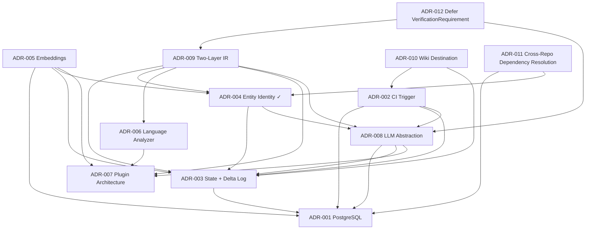

# ADR Index

Table of contents for the Knowledge Compiler's architectural decisions. For the ADR process (lifecycle, template, how to propose), see [README.md](README.md).

## Decisions

### [ADR-001 — PostgreSQL](ADR-001-postgresql.md)

- **Status:** Accepted
- **Summary:** A single PostgreSQL database is the only persistent store, covering relations, JSONB payloads, full-text search, vectors, transactions, and advisory locks in one system.
- **Dependencies:** none (foundation)
- **Depended on by:** ADR-002 (advisory locks, read-only serve), ADR-003 (transactional persist), ADR-005 (pgvector), ADR-008 (cache in Postgres)
- **Related documents:** architecture.md §5, data-model.md, storage.md (planned)

### [ADR-002 — CI Trigger](ADR-002-ci-trigger.md)

- **Status:** Accepted
- **Summary:** Compilation is triggered by CI invoking `kc compile --pr N` on merge, made exactly-once and self-healing by mandatory reconcile-first processing and per-repo advisory locks; the serve process never compiles.
- **Dependencies:** ADR-001 (locks), ADR-003 (`compile_runs` watermark, delta ordering), ADR-008 (cache bounds backlog cost); related: ADR-004 (in-order processing preserves matching state)
- **Depended on by:** —
- **Related documents:** architecture.md §3, pipeline.md, mcp.md (planned)

### [ADR-003 — Current State + Delta Log](ADR-003-current-state-delta-log.md)

- **Status:** Accepted
- **Summary:** Compiled knowledge is stored as mutable current-state tables plus an append-only delta log, written in one transaction per compile; history is deltas, and the past is recompilable, not stored.
- **Dependencies:** ADR-001 (transactions)
- **Depended on by:** ADR-002 (watermarking), ADR-004 (identity matches against current state), ADR-005 (delta-driven re-embedding), ADR-008 (incremental economics)
- **Related documents:** architecture.md §4–5, ir.md, data-model.md, pipeline.md

### [ADR-004 — Stable Entity Identity](ADR-004-entity-identity.md)

- **Status:** Accepted
- **Summary:** Deterministic entities use natural keys; LLM-derived entities use a deterministic match-then-mint cascade (external key → anchor overlap → name similarity); the LLM never assigns identity; over-split beats over-merge; reproducibility holds modulo slug renaming.
- **Dependencies:** ADR-003 (current state as matching target), ADR-008 (cache prevents extraction flapping)
- **Depended on by:** ADR-002 (in-order processing), ADR-005 (embeddings excluded from identity), ADR-006 (anchors as extractor obligation), ADR-008 (identity invariant enforced at the LLM layer); vision.md Design Principle 8 originates here
- **Related documents:** architecture.md §6, ir.md, data-model.md, pipeline.md

### [ADR-005 — Embeddings](ADR-005-embeddings-pgvector.md)

- **Status:** Accepted
- **Summary:** Embeddings live in pgvector as derived, disposable, model-tagged artifacts computed from compiled entities (never raw source), re-embedded delta-first, and excluded from identity and deltas.
- **Dependencies:** ADR-001 (single store), ADR-003 (delta-driven), ADR-004 (identity exclusion), ADR-007 (embedding/retrieval providers as plugins)
- **Depended on by:** —
- **Related documents:** architecture.md §7, data-model.md, retrieval.md

### [ADR-006 — Language Analyzer](ADR-006-language-analyzers.md)

- **Status:** Accepted
- **Summary:** tree-sitter is the mandatory language-analyzer backbone (in-process Python, no Node.js) with optional per-language enrichment plugins; the deterministic pass must alone produce a correct structural knowledge base.
- **Dependencies:** ADR-007 (analyzers are plugins); related: ADR-004 (anchors feed the identity cascade)
- **Depended on by:** —
- **Related documents:** architecture.md §8, §12, ir.md, pipeline.md, plugin-system.md (planned)

### [ADR-007 — Plugin Architecture](ADR-007-plugin-architecture.md)

- **Status:** Accepted
- **Summary:** Plugins are discovered via packaging entry points and activated only by explicit `kc.toml` configuration; installing a package never changes compilation output; built-ins have no privileged path; interfaces are versioned and fail loudly.
- **Dependencies:** none (foundation)
- **Depended on by:** ADR-005 (providers), ADR-006 (analyzers), ADR-008 (LLM providers)
- **Related documents:** architecture.md §9, plugin-system.md (planned), pipeline.md

### [ADR-008 — LLM Abstraction](ADR-008-llm-abstraction-caching.md)

- **Status:** Accepted
- **Summary:** LLM access goes through one thin schema-validated provider interface (providers as plugins) with a load-bearing content-addressed cache in Postgres keyed by (prompt template version, model, input content) — making full recompilation affordable and extraction output stable.
- **Dependencies:** ADR-001 (cache storage), ADR-003 (incremental economics), ADR-007 (providers as plugins)
- **Depended on by:** ADR-002 (backlog catch-up cost), ADR-004 (flapping prevention assumption)
- **Related documents:** architecture.md §10, §12, data-model.md, pipeline.md, plugin-system.md (planned)

### [ADR-009 — Two-Layer IR](ADR-009-two-layer-ir.md)

- **Status:** Accepted
- **Summary:** The canonical IR has two versioned layers with a directional boundary — Fact IR (per-compile extraction output, identity-free, the plugin contract) and Knowledge IR (durable entities + relationships, the consumer contract) — with Normalize as the only crossing point; the delta is a derived Knowledge IR artifact.
- **Dependencies:** ADR-003 (delta as derived artifact), ADR-004 (entity definition, identity boundary), ADR-006 (analyzers emit canonical facts), ADR-007 (fail-loud policy), ADR-008 (validated LLM candidates)
- **Depended on by:** — (implemented by `ir.md`)
- **Related documents:** ir.md (implements it), data-model.md, pipeline.md, plugin-system.md (planned)

### [ADR-010 — Wiki Destination](ADR-010-wiki-destination.md)

- **Status:** Accepted
- **Summary:** The wiki publishes to a dedicated `knowledge/wiki` branch in the compiled repository (forge-rendered Markdown, publisher-owned, loop-safe by construction since branch pushes are not the ADR-002 trigger event). The Publisher concept is general (publication → destination; see pipeline.md §3.6): Pages, separate knowledge repo, Confluence, and OKF bundle export are additive publishers. **The canonical home of compiled knowledge is the database (ADR-001); this ADR places only the human-readable render.**
- **Dependencies:** ADR-002 (trigger scoping the loop-safety argument), ADR-003 (delta log as history of record)
- **Depended on by:** — (unblocks the publisher plugin contract, pipeline.md §8)
- **Related documents:** architecture.md §11, pipeline.md §3.6/§8

### [ADR-011 — Cross-Repo Dependency Resolution](ADR-011-cross-repo-dependency-resolution.md)

- **Status:** Accepted
- **Summary:** Cross-repo dependency resolution (e.g. `X` importing `Y`) is query-time only for V1 — a `kc.toml` `[dependencies]` config map resolved in `kc serve`, matched exact-or-dotted-prefix. No Normalize/Persist/schema changes, no cross-`repo_id` reads during compile. The richer compiled `Project`-to-`Project` rollup edge (or full fine-grained cross-repo entity resolution) is explicitly deferred, not rejected, pending the milestone-3 evaluation-methodology question.
- **Dependencies:** ADR-001 (`repo_id` isolation invariant), ADR-004 (over-split-over-merge bias, extended to cross-repo linking)
- **Depended on by:** —
- **Related documents:** `BRAINSTORM-cross-repo-dependencies.md`, retrieval.md §5

### [ADR-012 — Defer VerificationRequirement Entity](ADR-012-defer-verification-requirement-entity.md)

- **Status:** Accepted
- **Summary:** `VerificationRequirement` (a candidate entity for LLM-extracted, sub-component verification obligations, e.g. "discount must not exceed 20%") is not added as a compiled entity in V1. Mutation-kill rate is the execution-based signal for sub-component test precision — it closes the motivating gap (declared-coverage can be 100% while missing the exact condition tested) at execution time, without new IR complexity or a richer agent workflow. Deferred, not rejected: reopens if agent-generated tests show a consistent pattern of high declared-coverage + low mutation-kill at scale, or if the component-vs-sub-component granularity mismatch noted in the ADR's rationale is shown to hide real misses.
- **Dependencies:** ADR-009 (two-layer IR — the entity model this would extend), ADR-008 (LLM semantic layer — the extraction mechanism this would use)
- **Depended on by:** —
- **Related documents:** `BRAINSTORM-verification-requirement.md`, `BRAINSTORM-test-generation-eval.md`, `BRAINSTORM-test-generation-mechanism.md` (full spike record)

## Dependency graph

Arrows point from an ADR to what it depends on. ADR-001 and ADR-007 are the two foundations; no cycles.

ADR-001 through ADR-010 were Accepted as of the 2026-07-18 v1.0 freeze; ADR-011 was added 2026-07-20, recording a genuinely new decision reached during dogfood; ADR-012 was added 2026-07-29, recording the VerificationRequirement deferral decision reached after milestone-3 test-generation spikes. All are immutable per the process in [README.md](README.md) — changes require a superseding ADR.

## Architecture v1.0 — FROZEN (2026-07-18)

The architectural specification is frozen as **v1.0**: vision.md, architecture.md, ADR-001…ADR-010, ir.md, data-model.md, pipeline.md. Freeze discipline:

- **ADRs** are immutable; changing a decision requires a superseding ADR (existing rule).
- **Living specs** (ir.md, data-model.md, pipeline.md) accept *additive clarifications* discovered during implementation; anything that breaks a stated invariant or contract requires a superseding ADR first.
- **No new architecture documents** unless implementation reveals a genuine gap. `retrieval.md`, `mcp.md`, and `storage.md` are deliberately deferred to be informed by code; `plugin-sdk.md` (contributor docs) waits until the built-in plugins stabilize the interfaces — trigger: first successful dogfood compile.
- Remaining pre-implementation work: `normalize.md` (algorithm specification), then implementation.

## Unresolved decisions → future ADRs / design documents

Decisions *not* made by this ADR set, listed with the document whose design should resolve them:

| Unresolved decision | Home |
|---|---|
| Conflict-resolution *policy* between sources (which outranks which, when) — ir.md §4.3 requires conflicts be representable and visible, but defers the ranking policy | future ADR |
| ~~Delta document schema and granularity; `entity_moved` representation~~ | resolved in `data-model.md` §2–3 |
| ~~Column-level schema; embedding model generations; `llm_cache` + delta-log retention~~ | resolved in `data-model.md` §2, §4 |
| Hybrid retrieval ranking (RRF tuning), chunking policy, retrieval evaluation | `retrieval.md` |
| Plugin interface deprecation/compatibility policy; per-plugin config validation | `plugin-system.md` |
| ~~Reconciliation algorithm detail; compile scope under squash/rebase merges; `--no-llm` degraded-compile semantics~~ | resolved in `pipeline.md` §4–6 |
| MCP tool surface and context-shaping for agents | `mcp.md` |
| ~~Wiki publishing destination~~ | resolved by [ADR-010](ADR-010-wiki-destination.md) (Proposed) |
| Identity-matching thresholds | configuration + dogfood tuning (per ADR-004, explicitly not ADR material) |
| Test-generation evaluation methodology | pre-milestone-3 design doc |
| ~~Cross-repo dependency resolution~~ | V1 reference behavior resolved by [ADR-011](ADR-011-cross-repo-dependency-resolution.md) (query-time config map); the compiled coordinate+resolver+rollup-edge design sketched here remains an explicitly deferred option in that ADR, not yet decided |
| Dependency **version constraints** as an additive `dependency_observed` payload field (from lockfiles/manifests — deterministic facts). Non-breaking per ir.md §5 | pre-milestone-3; may land earlier since collection is trivial |
| **Releases as named checkpoints**: a `releases` label table (version → git tag → commit → compile run) over the existing delta log. Version-skew queries ("what changed in B between A's pinned v2.3 and v2.5?") = delta-window queries between checkpoints ∩ dependency edges — **no entity snapshots**. Possible additive Release entity for wiki/release-notes pages | pre-milestone-3 design |
| **Rejected (recorded to prevent re-litigation):** per-release entity snapshots / version-attached relationships (`PaymentClient@v2.3`) — this is ADR-003's rejected Option A at release granularity; the delta log + checkpoints serve the use case without the permanent temporal-key tax. Reopening requires superseding ADR-003 with evidence the delta-window mechanism failed | — |
| **Lazy snapshot materialization** (distinct from the rejected eager snapshots above): on-demand recompile at a pinned revision, cached as a derived artifact keyed by `(repo, commit, compiler version, config)` — cache key must include compiler/prompt versions or snapshots silently diverge across upgrades. Requires **slug-seeding**: the snapshot compile's identity map is seeded from current state (ADR-004 slug-preserving mechanics extended to scratch scopes), else snapshot entities aren't joinable to current-state slugs | pre-milestone-3 design |
| **Three-tier correctness rule for historical state** (write down explicitly, or replay creeps into correctness-critical paths): delta-log *replay* for cheap field-level lookups and display; *materialized snapshots* for correctness-critical full state; *recompile* as ground truth. The delta log is never event sourcing (ADR-003 invariant: history, not a reconstruction input) | pre-milestone-3 design |
| ~~**Verification Requirement** as a candidate entity~~ | Resolved by [ADR-012](ADR-012-defer-verification-requirement-entity.md) (Accepted 2026-07-29): deferred; mutation-kill rate is the V1 sub-component precision signal. Revisit trigger: pattern of ≥80% declared-coverage + ≤40% mutation-kill at scale. |
